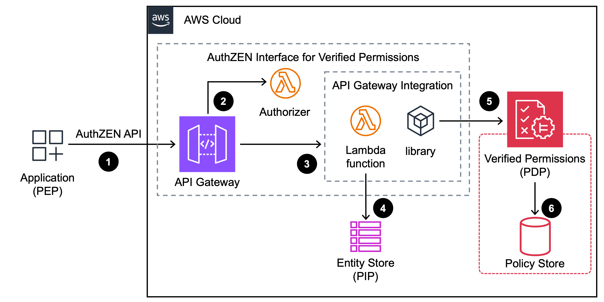
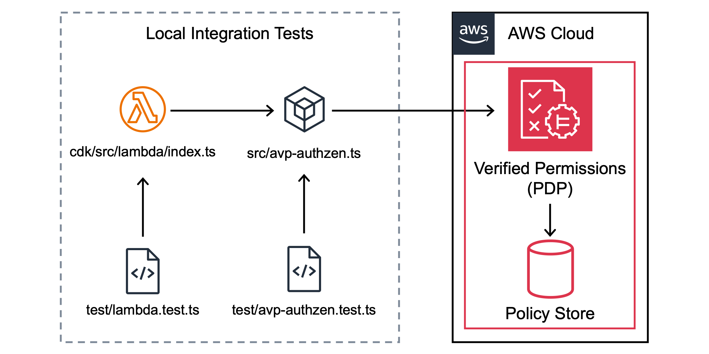

# OpenID AuthZEN Interface for Amazon Verified Permissions

This reference implementation enables interoperability and seamless integration between [OpenID’s AuthZEN protocol](https://openid.net/wg/authzen/specifications/) and [Amazon Verified Permissions](https://aws.amazon.com/verified-permissions/).  It implements the OpenID AuthZEN Interop Payload Spec for both the [Todo (1.0 Draft 02)](https://authzen-interop.net/docs/scenarios/todo-1.1/) and [API Gateway (1.0 Draft 02)](https://authzen-interop.net/docs/scenarios/api-gateway/).

Read the related AWS Security Blog post: [How to support OpenID AuthZEN requests with Amazon Verified Permissions](https://aws.amazon.com/blogs/security/how-to-support-openid-authzen-requests-with-amazon-verified-permissions/).

## Project structure

The AuthZEN interface implementation can be found in the `src` directory.

- AuthZEN Zod schemas / TypeScript types (`src/authzen.ts`) based on [Authorization API 1.0 – draft 03](https://openid.github.io/authzen/).
- Amazon Verified Permissions implementation (`src/avp-authzen.ts`)
- Cedar WASM implementation (`src/cedar-authzen.ts`)

The project includes two CDK stacks found in the `cdk` directory.

1. An `AuthZENPolicyStoreStack` which implements the AuthZEN Interop test data as an Amazon Verified Permissions policy store for policies and an Amazon DynamoDB table for entities.
1. An `AuthZENPDPStack` stack which implements the AuthZEN [HTTPS binding transport specification](https://openid.github.io/authzen/#name-https-binding) as an Amazon API Gateway REST API.



The workflow for this architecture is as follows:

1. The application, serving as a policy enforcement point (PEP), makes an authenticated authorization API call for access requests in AuthZEN-compliant format.
1. Amazon API Gateway invokes an AWS Lambda authorizer to evaluate the PEP authentication mechanism of the choice.

    **Note**: In this sample, access to the API uses a shared secret generated by AWS Secrets Manager. Review your threat model and adopt authentication mechanisms that fit your workload, such as OAuth 2.0 bearer tokens, client certificate authentication, or AWS Identity and Access Management (IAM) temporary credentials.

1. After successful authentication, API Gateway propagates the request to a Lambda function integration.
1. The Lambda function queries the entity store, which acts as a policy information point (PIP), to retrieve additional metadata and attributes about the entities in the authorization request. The entities are representing the principals and the resources.
1. The Lambda function integration transforms the authorization requests in AuthZEN format into a Verified Permissions [`IsAuthorized()`](https://docs.aws.amazon.com/verifiedpermissions/latest/apireference/API_IsAuthorized.html) formatted request.
1. Verified Permissions evaluates the authorization request and returns the authorization decision, then the Lambda function transforms the authorization decision to an AuthZEN formatted decision back to the application.

As a prerequisite to deploy these stacks, first `git clone` this repository then `npm install`.

## CDK stack for AuthZEN Interop test data

The AuthZEN Interop scenario and test data were implemented as [Cedar Policy Language](https://docs.cedarpolicy.com/) policies (`cedar/*.cedar` files) and [JSON formatted entities](https://docs.cedarpolicy.com/auth/entities-syntax.html#entities) (`cedar/cedarentities.json` file).  `AuthZENPolicyStoreStack` loads the policy files into a Verified Permissions policy store and the entity data into a DynamoDB table.

1. To deploy this stack, run `npm run cdk:policystore` or `cd cdk && npx cdk deploy AuthZENPolicyStoreStack`.  After the deployment completes, check `cdk/cdk-outputs.json` or view `Outputs` on console:

    ```text
    Outputs:
    AuthZENPolicyStoreStack.CedarEntitiesTableName = AuthZENPolicyStoreStack-EntitiesCedarEntitiesTableXXXXXXX-XXXXXXXXXXXXX
    AuthZENPolicyStoreStack.PolicyStoreId = abcdef01234567890
    Stack ARN:
    arn:aws:cloudformation:aa-example-1:000000000000:stack/AuthZENPolicyStoreStack/a1b2c3d4-5678-90ab-cdef-EXAMPLE11111
    ```

Note:  The test data in this project uses the same unique IDs, but modified example user names and emails.

| PID | user name | user email |
| -- | -- | -- |
| CiRmZDA2MTRkMy1jMzlhLTQ3ODEtYjdiZC04Yjk2ZjVhNTEwMGQSBWxvY2Fs | Richard Roe | <richard_roe@example.com> |
| CiRmZDM2MTRkMy1jMzlhLTQ3ODEtYjdiZC04Yjk2ZjVhNTEwMGQSBWxvY2Fs | Jane Doe | <jane_doe@example.com> |
| CiRmZDE2MTRkMy1jMzlhLTQ3ODEtYjdiZC04Yjk2ZjVhNTEwMGQSBWxvY2Fs | John Doe | <john_doe@example.com> |
| CiRmZDI2MTRkMy1jMzlhLTQ3ODEtYjdiZC04Yjk2ZjVhNTEwMGQSBWxvY2Fs | Nikki Wolf | <nikki_wolf@example.com> |
| CiRmZDQ2MTRkMy1jMzlhLTQ3ODEtYjdiZC04Yjk2ZjVhNTEwMGQSBWxvY2Fs | Jorge Souza | <jorge_souza@example.com> |

### Local Integration Tests

Most of the `test/*.test.ts` files only require `AuthZENPolicyStoreStack` and some environment variables.

- Cedar WASM implementation unit tests (`test/cedar-authzen.test.ts`)
- Amazon Verified Permissions integration tests (`test/avp-authzen.test.ts`)
- DynamoDB PIP implementation integration tests (`test/pip.test.ts`)
- Lambda function implementation integration tests (`test/lambda.test.ts`)

To run any of these:

1. In your shell, export the `POLICY_STORE_ID` and `ENTITIES_TABLE_NAME` environment variables:

    ```shell
    export POLICY_STORE_ID=abcdef01234567890
    export ENTITIES_TABLE_NAME=AuthZENPolicyStoreStack-EntitiesCedarEntitiesTableXXXXXXX-XXXXXXXXXXXXX
    ```

1. Run any of the test files using `npx vitest test/xxx.test.ts` command.



## CDK stack for AuthZEN HTTPS binding

Deploys an AuthZEN 1.0 Draft 02 interop scenario compliant policy decision point (PDP) connected to the Verified Permissions policy store and DynamoDB table.

1. To deploy the `AuthZENPDPStack` stack, run `npm run cdk:pdp` or the command below:

    ```shell
    cd cdk && npx cdk deploy -c policyStoreId=$POLICY_STORE_ID -c tableName=$ENTITIES_TABLE_NAME AuthZENPDPStack
    ```

    Note: This stack allows for optional parameters to use a custom domain name:

    ```shell
    cd cdk && npx cdk deploy -c policyStoreId=$POLICY_STORE_ID -c tableName=$ENTITIES_TABLE_NAME -c hostname=authzen-interface.example.com -c certificateArn=arn:aws:acm:aa-example-1:000000000000:certificate/xxx AuthZENPDPStack
    ```

1. After the deployment completes, check `cdk-outputs.json` or view `Outputs` on console:

    ```text
    Outputs:
    AuthZENPDPStack.ApiCredentialsSecretArn = arn:aws:secretsmanager:aa-example-1:000000000000:secret:ApiCredentials-XXX
    AuthZENPDPStack.RestApiEndpoint01234567 = https://xxxxxxxxxx.execute-api.aa-example-1.amazonaws.com/prod/
    Stack ARN:
    arn:aws:cloudformation:aa-example-1:000000000000:stack/AuthZENPDPStack/a1b2c3d4-5678-90ab-cdef-EXAMPLE11111
    ```

1. Use the AWS Console or an AWS CLI command to get the value of this shared secret.

    ```shell
    export SECRET_ARN=arn:aws:secretsmanager:aa-example-1:000000000000:secret:ApiCredentials-XXX
    aws secretsmanager get-secret-value --secret-id $SECRET_ARN --query 'SecretString' --output text | jq -r '.authSecret'
    ```

### Integration Tests

The API Gateway integration tests (`test/apigateway.test.ts`) and full test suite are now available to run.

1. In your shell, export the `AUTHZEN_PDP_URL` and `AUTHZEN_PDP_API_KEY` environment variables:

    ```shell
    export AUTHZEN_PDP_URL=https://xxxxxxxxxx.execute-api.aa-example-1.amazonaws.com/prod
    export AUTHZEN_PDP_API_KEY=$(aws secretsmanager get-secret-value --secret-id $SECRET_ARN --query 'SecretString' --output text | jq -r '.authSecret')
    ```

1. Run the `npx vitest test/apigateway.test.ts` command.
1. Run all tests with `npm run test`.

    ```shell
    ✓ cedar-authzen.test.ts (69 tests) 323ms
     ✓ pip.test.ts (3 tests) 1209ms
       ✓ Cedar DynamoDB PIP > Richard Roe 1199ms
     ✓ avp-authzen.test.ts (68 tests) 5119ms
       ✓ Verified Permissions Interop > Testing 'CiRmZDA2MTRkMy1jMzlhLTQ3ODEtYjdiZC04Y…' 'GET' '/users/{userId}' 1189ms
     ✓ server.test.ts (68 tests) 5467ms
       ✓ Express App Integration Tests > Testing 'CiRmZDA2MTRkMy1jMzlhLTQ3ODEtYjdiZC04Y…' 'GET' '/users/{userId}' 1081ms
     ✓ lambda.test.ts (68 tests) 9196ms
       ✓ Lambda Function Tests > Testing evaluation 'CiRmZDA2MTRkMy1jMzlhLTQ3ODEtYjdiZC04Y…' 'GET' '/users/{userId}' 1876ms
     ✓ apigateway.test.ts (71 tests) 23703ms
       ✓ API Gateway Integration Tests > Testing 'CiRmZDA2MTRkMy1jMzlhLTQ3ODEtYjdiZC04Y…' 'GET' '/users/{userId}' 1944ms
    
     Test Files  6 passed (6)
          Tests  347 passed (347)
       Start at  11:20:11
       Duration  24.76s (transform 735ms, setup 0ms, collect 3.52s, tests 45.02s, environment 2ms, prepare 1.16s)
    ```

## AuthZEN interop scenario test

To test using the official interop test suite, fork or `git pull` the [AuthZEN Repository](https://github.com/openid/authzen) and follow README instructions for [AuthZEN API Gateway Test Runner](https://github.com/openid/authzen/tree/main/interop/authzen-api-gateways/test-harness) (`interop/authzen-api-gateways/test-harness` directory).

This also expects the `AUTHZEN_PDP_URL` and `AUTHZEN_PDP_API_KEY` environment variables to be set.

```shell
$ export AUTHZEN_PDP_URL=https://xxxxxxxxxx.execute-api.aa-example-1.amazonaws.com/prod
$ export AUTHZEN_PDP_API_KEY=XXX
$ yarn test $AUTHZEN_PDP_URL
yarn run v1.22.19
$ node build/runner.js https://xxxxxxxxxx.execute-api.aa-example-1.amazonaws.com/prod
PASS REQ: {"subject":{"type":"identity","id":"CiRmZDA2MTRkMy1jMzlhLTQ3ODEtYjdiZC04Yjk2ZjVhNTEwMGQSBWxvY2Fs"},"action":{"name":"GET"},"resource":{"type":"route","id":"/users/{userId}"}}
PASS REQ: {"subject":{"type":"identity","id":"CiRmZDA2MTRkMy1jMzlhLTQ3ODEtYjdiZC04Yjk2ZjVhNTEwMGQSBWxvY2Fs"},"action":{"name":"GET"},"resource":{"type":"route","id":"/todos"}}
PASS REQ: {"subject":{"type":"identity","id":"CiRmZDA2MTRkMy1jMzlhLTQ3ODEtYjdiZC04Yjk2ZjVhNTEwMGQSBWxvY2Fs"},"action":{"name":"POST"},"resource":{"type":"route","id":"/todos"}}
PASS REQ: {"subject":{"type":"identity","id":"CiRmZDA2MTRkMy1jMzlhLTQ3ODEtYjdiZC04Yjk2ZjVhNTEwMGQSBWxvY2Fs"},"action":{"name":"PUT"},"resource":{"type":"route","id":"/todos/{todoId}"}}
PASS REQ: {"subject":{"type":"identity","id":"CiRmZDA2MTRkMy1jMzlhLTQ3ODEtYjdiZC04Yjk2ZjVhNTEwMGQSBWxvY2Fs"},"action":{"name":"DELETE"},"resource":{"type":"route","id":"/todos/{todoId}"}}
PASS REQ: {"subject":{"type":"identity","id":"CiRmZDE2MTRkMy1jMzlhLTQ3ODEtYjdiZC04Yjk2ZjVhNTEwMGQSBWxvY2Fs"},"action":{"name":"GET"},"resource":{"type":"route","id":"/users/{userId}"}}
PASS REQ: {"subject":{"type":"identity","id":"CiRmZDE2MTRkMy1jMzlhLTQ3ODEtYjdiZC04Yjk2ZjVhNTEwMGQSBWxvY2Fs"},"action":{"name":"GET"},"resource":{"type":"route","id":"/todos"}}
PASS REQ: {"subject":{"type":"identity","id":"CiRmZDE2MTRkMy1jMzlhLTQ3ODEtYjdiZC04Yjk2ZjVhNTEwMGQSBWxvY2Fs"},"action":{"name":"POST"},"resource":{"type":"route","id":"/todos"}}
PASS REQ: {"subject":{"type":"identity","id":"CiRmZDE2MTRkMy1jMzlhLTQ3ODEtYjdiZC04Yjk2ZjVhNTEwMGQSBWxvY2Fs"},"action":{"name":"PUT"},"resource":{"type":"route","id":"/todos/{todoId}"}}
PASS REQ: {"subject":{"type":"identity","id":"CiRmZDE2MTRkMy1jMzlhLTQ3ODEtYjdiZC04Yjk2ZjVhNTEwMGQSBWxvY2Fs"},"action":{"name":"DELETE"},"resource":{"type":"route","id":"/todos/{todoId}"}}
PASS REQ: {"subject":{"type":"identity","id":"CiRmZDI2MTRkMy1jMzlhLTQ3ODEtYjdiZC04Yjk2ZjVhNTEwMGQSBWxvY2Fs"},"action":{"name":"GET"},"resource":{"type":"route","id":"/users/{userId}"}}
PASS REQ: {"subject":{"type":"identity","id":"CiRmZDI2MTRkMy1jMzlhLTQ3ODEtYjdiZC04Yjk2ZjVhNTEwMGQSBWxvY2Fs"},"action":{"name":"GET"},"resource":{"type":"route","id":"/todos"}}
PASS REQ: {"subject":{"type":"identity","id":"CiRmZDI2MTRkMy1jMzlhLTQ3ODEtYjdiZC04Yjk2ZjVhNTEwMGQSBWxvY2Fs"},"action":{"name":"POST"},"resource":{"type":"route","id":"/todos"}}
PASS REQ: {"subject":{"type":"identity","id":"CiRmZDI2MTRkMy1jMzlhLTQ3ODEtYjdiZC04Yjk2ZjVhNTEwMGQSBWxvY2Fs"},"action":{"name":"PUT"},"resource":{"type":"route","id":"/todos/{todoId}"}}
PASS REQ: {"subject":{"type":"identity","id":"CiRmZDI2MTRkMy1jMzlhLTQ3ODEtYjdiZC04Yjk2ZjVhNTEwMGQSBWxvY2Fs"},"action":{"name":"DELETE"},"resource":{"type":"route","id":"/todos/{todoId}"}}
PASS REQ: {"subject":{"type":"identity","id":"CiRmZDM2MTRkMy1jMzlhLTQ3ODEtYjdiZC04Yjk2ZjVhNTEwMGQSBWxvY2Fs"},"action":{"name":"GET"},"resource":{"type":"route","id":"/users/{userId}"}}
PASS REQ: {"subject":{"type":"identity","id":"CiRmZDM2MTRkMy1jMzlhLTQ3ODEtYjdiZC04Yjk2ZjVhNTEwMGQSBWxvY2Fs"},"action":{"name":"GET"},"resource":{"type":"route","id":"/todos"}}
PASS REQ: {"subject":{"type":"identity","id":"CiRmZDM2MTRkMy1jMzlhLTQ3ODEtYjdiZC04Yjk2ZjVhNTEwMGQSBWxvY2Fs"},"action":{"name":"POST"},"resource":{"type":"route","id":"/todos"}}
PASS REQ: {"subject":{"type":"identity","id":"CiRmZDM2MTRkMy1jMzlhLTQ3ODEtYjdiZC04Yjk2ZjVhNTEwMGQSBWxvY2Fs"},"action":{"name":"PUT"},"resource":{"type":"route","id":"/todos/{todoId}"}}
PASS REQ: {"subject":{"type":"identity","id":"CiRmZDM2MTRkMy1jMzlhLTQ3ODEtYjdiZC04Yjk2ZjVhNTEwMGQSBWxvY2Fs"},"action":{"name":"DELETE"},"resource":{"type":"route","id":"/todos/{todoId}"}}
PASS REQ: {"subject":{"type":"identity","id":"CiRmZDQ2MTRkMy1jMzlhLTQ3ODEtYjdiZC04Yjk2ZjVhNTEwMGQSBWxvY2Fs"},"action":{"name":"GET"},"resource":{"type":"route","id":"/users/{userId}"}}
PASS REQ: {"subject":{"type":"identity","id":"CiRmZDQ2MTRkMy1jMzlhLTQ3ODEtYjdiZC04Yjk2ZjVhNTEwMGQSBWxvY2Fs"},"action":{"name":"GET"},"resource":{"type":"route","id":"/todos"}}
PASS REQ: {"subject":{"type":"identity","id":"CiRmZDQ2MTRkMy1jMzlhLTQ3ODEtYjdiZC04Yjk2ZjVhNTEwMGQSBWxvY2Fs"},"action":{"name":"POST"},"resource":{"type":"route","id":"/todos"}}
PASS REQ: {"subject":{"type":"identity","id":"CiRmZDQ2MTRkMy1jMzlhLTQ3ODEtYjdiZC04Yjk2ZjVhNTEwMGQSBWxvY2Fs"},"action":{"name":"PUT"},"resource":{"type":"route","id":"/todos/{todoId}"}}
PASS REQ: {"subject":{"type":"identity","id":"CiRmZDQ2MTRkMy1jMzlhLTQ3ODEtYjdiZC04Yjk2ZjVhNTEwMGQSBWxvY2Fs"},"action":{"name":"DELETE"},"resource":{"type":"route","id":"/todos/{todoId}"}}
✨  Done in 3.45s.
```

## Production considerations

This reference implementation includes design decisions that need to be revisited before a production deployment with production data.

1. It creates a public facing regional API Gateway protected by a shared secret linked to an API Key/Usage Plan with low throttling limits.  A stronger authentication mechanism that is user/system unique should be implemented.  In addition, depending on the network location of your PEP, either add AWS WAF or convert to a private REST API:

    - [Use AWS WAF to protect your REST APIs in API Gateway](https://docs.aws.amazon.com/apigateway/latest/developerguide/apigateway-control-access-aws-waf.html)
    - [Private REST APIs in API Gateway](https://docs.aws.amazon.com/apigateway/latest/developerguide/apigateway-private-apis.html)

1. It includes logging of request/response data which has the potential to expose sensitive information since minimal log sanitization has been implemented.  A CloudWatch Logs data protection policy does [mask sensitive data](https://docs.aws.amazon.com/AmazonCloudWatch/latest/logs/mask-sensitive-log-data.html) of names and email addresses from the `PDPLambda` log group.
1. The `AuthZENPolicyStoreStack` deletes resources on cleanup which could incur data loss.  Also, point-in-time recovery is disabled for the DynamoDB table.
1. The `AuthZENPDPStack` deletes resources on cleanup, which include observability items such as CloudWatch Log Groups.

## Clean Up

To avoid ongoing costs and to clean up the resources that you deployed in your AWS account, run `npx cdk destroy` or delete the CloudFormation stacks from the AWS Console.

## Security

See [CONTRIBUTING](CONTRIBUTING.md#security-issue-notifications) for more information.

## License

This library is licensed under the MIT-0 License. See the LICENSE file.
